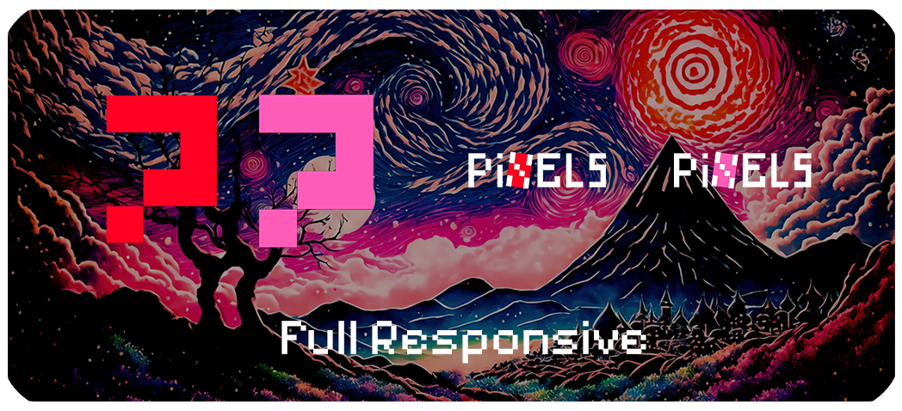
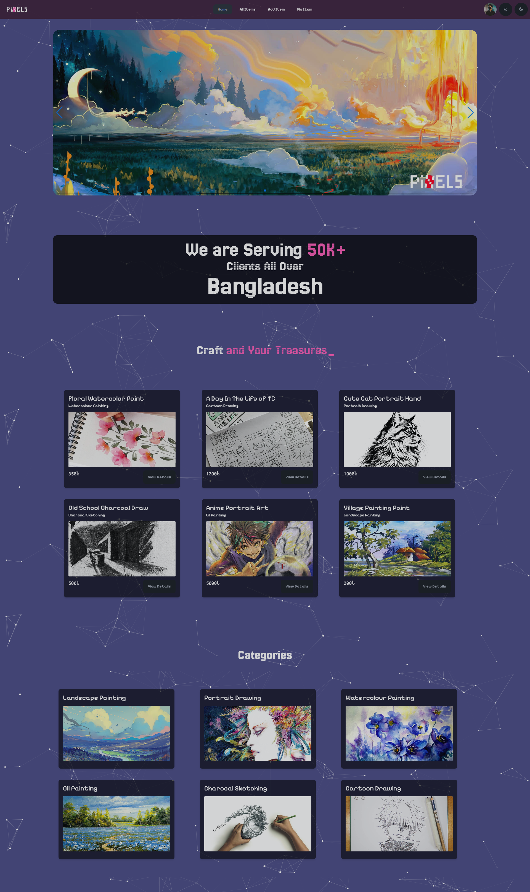
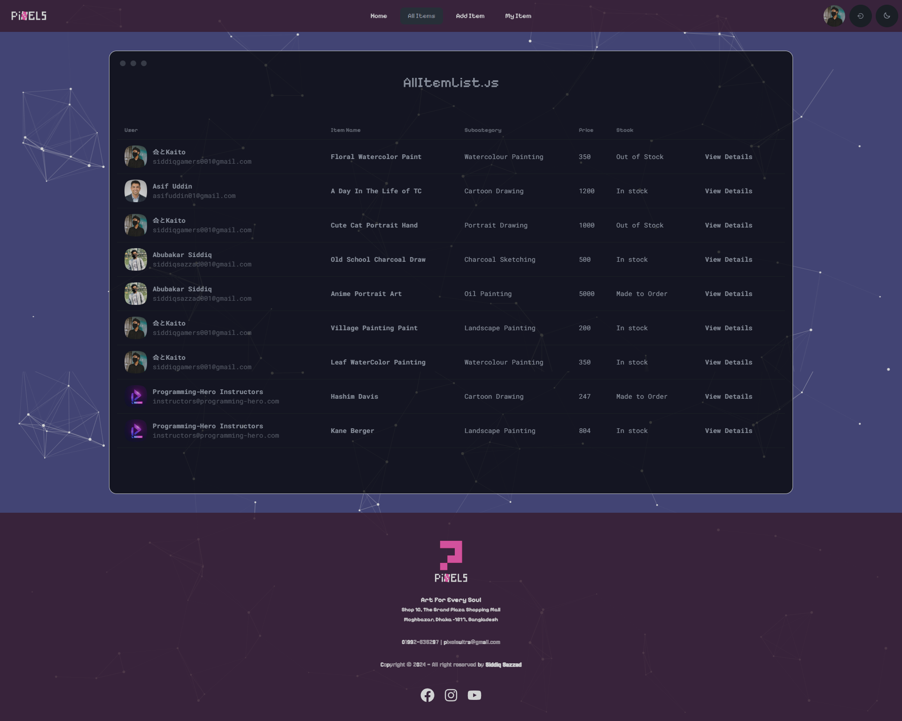
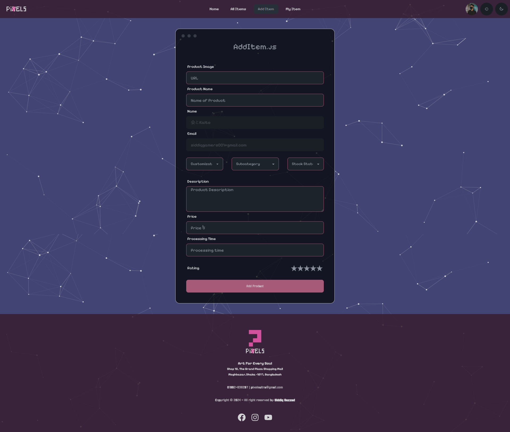
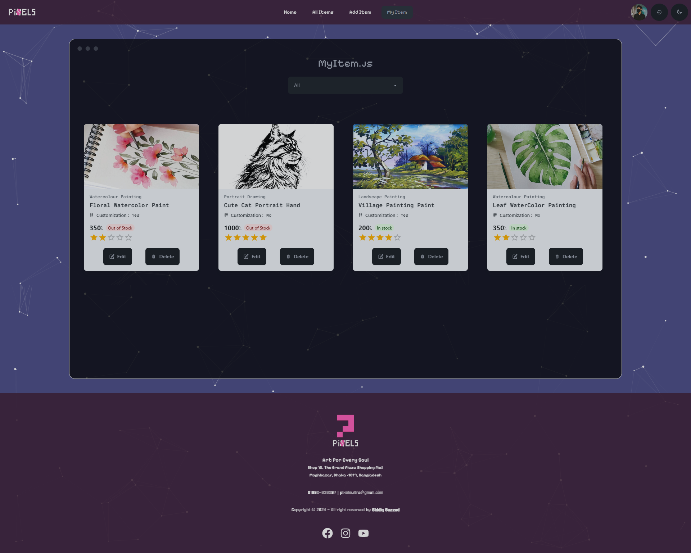

<h2 align="center"><u>Pixel - Art & Craft Store</u></h2>


<p align="center">
    
    
    
<br>
    
    
    
    
</p>

### Description
Pixel Art and Craft Website is a dynamic and immersive online platform dedicated to celebrating the timeless fusion of artistic expression and technological innovation. Whether you're an avid pixel artist, a craft enthusiast, or simply someone who appreciates the beauty of handmade creations, Pixel offers a rich and interactive experience that caters to diverse creative interests. Built with cutting-edge technologies like **React.js, Express.js, Node.js, and MongoDB**, this repository houses the codebase that powers Pixel's immersive online experience.

### Installation
 - `git clone https://github.com/nekokaito/Pixel.git`
 - `npm i `
 - `npm run dev`


### Live Site 
-  [Pixel](https://pixels-shop-bd.web.app/)


### Preview


<table style="width: 100%;">
  <tr>
    <td style="width: 50%;">
      
    </td>
    <td style="width: 50%;">
      
    </td>
  </tr>
  <tr>
    <td colspan="2" style="width: 50%;">
      
    </td>
  </tr>
</table>


### Features:
- **CRUD Operations**: Easily create, read, update, and delete artworks, providing a seamless experience for managing inventory.
- **Beautiful UI Design**: Pixel boasts a visually stunning user interface, enhancing the browsing and shopping experience for art enthusiasts.
- **Wide Range of Artworks**: Explore a diverse collection of paintings and drawings, catering to various tastes and preferences.
- **Responsive Design**: Access Pixel from any device, as the website is optimized for desktops, tablets, and smartphones, ensuring a consistent experience across platforms.
- **Secure Login**: Protect your account with Pixel's secure login system, ensuring the safety of your personal information.

### Packages Used:
```json
{
  "@emotion/react": "^11.11.4",
  "@emotion/styled": "^11.11.5",
  "@material-tailwind/react": "^2.1.9",
  "@mui/joy": "^5.0.0-beta.36",
  "@mui/material": "^5.15.15",
  "@tsparticles/all": "^3.3.0",
  "@tsparticles/react": "^3.0.0",
  "aos": "^2.3.4",
  "daisyui": "^4.10.2",
  "firebase": "^10.11.1",
  "localforage": "^1.10.0",
  "match-sorter": "^6.3.4",
  "prop-types": "^15.8.1",
  "react": "^18.2.0",
  "react-dom": "^18.2.0",
  "react-hot-toast": "^2.4.1",
  "react-icons": "^5.1.0",
  "react-router-dom": "^6.23.0",
  "react-simple-typewriter": "^5.0.1",
  "react-slider": "^2.0.6",
  "react-tooltip": "^5.26.3",
  "sort-by": "^0.0.2",
  "sweetalert2": "^11.10.8",
  "swiper": "^11.1.1"
}
```
